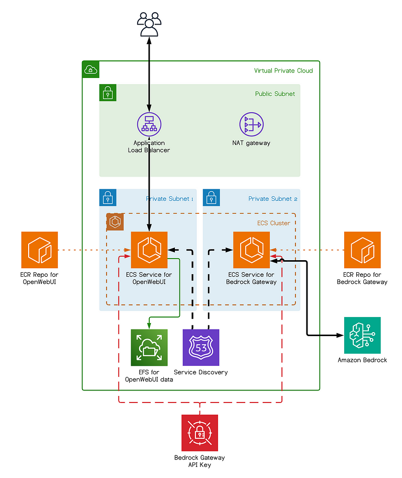
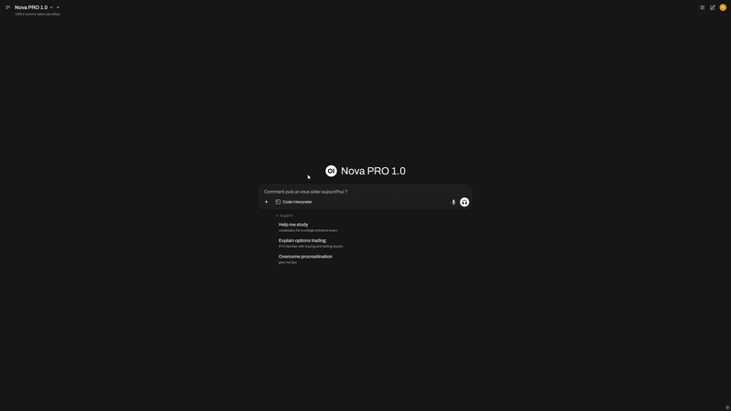

<div align="center">

# 🧠 AWS Bedrock Chatbot

**A self-hosted generative AI assistant powered by Amazon Bedrock.**

Open WebUI · Bedrock Access Gateway · MCP tools — containerized and deployed on AWS ECS Fargate with Terraform.

[](https://www.terraform.io/)
[](https://aws.amazon.com/fargate/)
[](https://aws.amazon.com/bedrock/)

📖 Read the companion article on [Medium](https://aws.plainenglish.io/deploying-your-own-chatgpt-on-aws-with-amazon-bedrock-and-open-webui-eb4ae62bfc74)

</div>

---

## Overview

This repository deploys a complete, private generative-AI chatbot on your own AWS account — a polished chat UI backed by Amazon Bedrock models (Claude, Titan, …), without writing a single line of frontend code. Everything is defined as Terraform and shipped as containers on ECS Fargate.





> [!NOTE]
> This project is intended as a **proof of concept / starting point**. The defaults favor a fast, low-friction deploy over production hardening — see [Security notes](#security-notes) before exposing it publicly.

## Features

- 🧱 **Amazon Bedrock** — Claude, Titan and other foundation models
- 💬 **[Open WebUI](https://github.com/open-webui/open-webui)** — a sleek, ChatGPT-style interface
- 🔁 **[Bedrock Access Gateway](https://github.com/aws-samples/bedrock-access-gateway)** — an OpenAI-compatible API in front of Bedrock
- 🔌 **[MCPO](https://github.com/open-webui/mcpo)** — exposes MCP servers (time, GitLab, Linear, …) to the UI as tools
- ☁️ **ECS Fargate (ARM64)** — fully serverless containers
- 🔒 **Batteries included** — VPC, ALB, EFS, S3, Secrets Manager, IAM, optional custom domain & VPC endpoints

## Architecture

| Component | Role |
| --- | --- |
| **Application Load Balancer** | Public entry point (HTTP, or HTTPS with a custom domain) |
| **Open WebUI** | Chat UI on ECS Fargate (private subnet), data persisted on **EFS**, uploads on **S3** |
| **Bedrock Access Gateway** | Translates OpenAI-style calls into Bedrock; reached at `gateway.bedrock.local` |
| **MCPO** | Serves MCP tools over HTTP at `mcpo.bedrock.local` |
| **Cloud Map** | Private service discovery (`*.bedrock.local`) between services |
| **Secrets Manager** | API keys and third-party tokens |
| **S3** | Remote Terraform state (native lock) + user uploads |

## Prerequisites

- An **AWS account** with [Bedrock model access](https://docs.aws.amazon.com/bedrock/latest/userguide/model-access.html) enabled
- **AWS CLI** configured with a named profile
- **Docker** running locally — images are built and pushed to ECR during `apply`
- **Terraform** `>= 1.11.0`

## Quick Start

```bash
git clone https://github.com/louis-fiori/aws-bedrock-chatbot.git
cd aws-bedrock-chatbot

# 1. Configure your AWS account / region / profile
cp terraform.tfvars.example terraform.tfvars
$EDITOR terraform.tfvars

# 2. Deploy
./deploy.sh
```

`deploy.sh` is a thin wrapper around the Makefile. The equivalent manual steps are:

```bash
make setup-state   # one-time: create the S3 bucket for the remote state
make init          # configure the S3 backend
make apply         # clone sources, build & push images, deploy the stack
```

When it finishes, grab the URL and open it in your browser:

```bash
make output
```

Register an account on first visit and start chatting with Bedrock models.

> The Terraform run automatically clones the Open WebUI and Bedrock Access Gateway sources and raises the Node build memory limit for the Open WebUI image — no manual editing required.

## Configuration

All inputs live in `terraform.tfvars` (see `terraform.tfvars.example`).

| Variable | Default | Description |
| --- | --- | --- |
| `account_id` | — | Your AWS account ID |
| `region` | `eu-west-1` | Deployment region |
| `profile` | — | AWS CLI profile to use |
| `domain_name` | `null` | Custom domain (required when `enable_domain` is `true`) |
| `feature_toggles.enable_domain` | `false` | Provision an ACM certificate and serve HTTPS on the ALB. Requires `domain_name` and an existing Route 53 hosted zone, plus a DNS record pointing the domain at the ALB (`make output`). |
| `feature_toggles.enable_vpc_endpoints` | `false` | Add interface VPC endpoints (Bedrock, ECR, Secrets Manager, Logs, …) for private connectivity |

Model/source versions (Open WebUI, Bedrock Access Gateway) are pinned in [`variables.tf`](variables.tf).

### MCPO third-party tokens

MCPO ships with GitLab and Linear MCP servers. Their tokens are created in Secrets Manager with a `REPLACE_ME` placeholder so the service can start; set the real values once after the first deploy (Terraform won't overwrite them):

```bash
aws secretsmanager put-secret-value --secret-id <gitlab-token-...> --secret-string "<your-gitlab-pat>"
aws secretsmanager put-secret-value --secret-id <linear-token-...> --secret-string "<your-linear-key>"
```

## Security notes

This is a POC; review these before any real-world exposure:

- **No TLS without a domain** — with `enable_domain = false` the app is served over plain **HTTP**.
- **Open sign-up** — anyone who can reach the load balancer can register an account.
- **Broad IAM** — task roles use wide permissions (`bedrock:*`, `s3:*`) for convenience.

For production: enable a domain (HTTPS), restrict access (WAF / source IPs / auth), and scope the IAM policies down.

## Teardown

```bash
make destroy   # destroy the application stack
make clean     # remove cloned sources and local Terraform files
```

The remote state bucket created by `make setup-state` is **not** removed by `make destroy` — delete it manually if you want to clean up everything.

## Troubleshooting

- **Open WebUI build runs out of memory** — the Node build memory limit is already raised automatically; if it still fails, give Docker more memory.
- **MCPO tools fail to authenticate** — make sure you replaced the `REPLACE_ME` token placeholders (see above).
